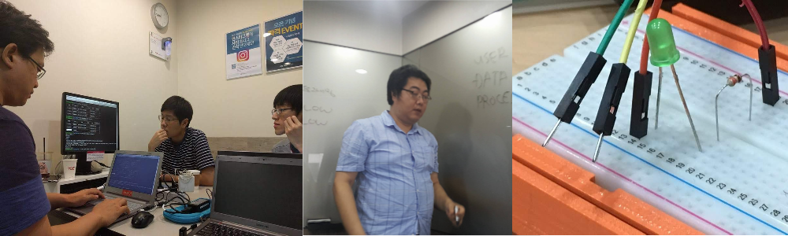
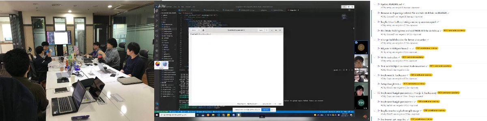

# Study Groups

We periodically select topics related to Ubuntu or open source technologies for study groups.

We cover topics such as containers (Docker/LXD), Linux desktop application development, server administration, and more.

Topics can be proposed by members or planned by the organization team, and announcements are made through our Telegram group and social media.

- [View organization on GitHub](https://github.com/ubuntu-ve)

# Projects

We participate in existing open source projects or develop new tools related to Ubuntu.

We aim to support local software development, the localization (translation) of Ubuntu into Spanish, and research in areas such as embedded development and input systems.

The results of these projects are shared through our GitHub.

- [View projects on GitHub](https://github.com/ubuntu-ve)
